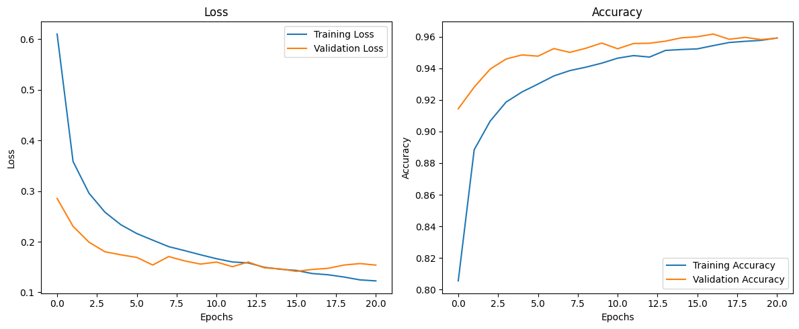

<h1 align="center">Digit Classification with ANN</h1>

<h2 align="center">Description</h2>

<p align="justify">
Digit classification is a fundamental problem in computer vision that aims to recognize handwritten digits from images.
In this project, an <b>Artificial Neural Network (ANN)</b> is developed to classify handwritten digits (0–9) using the
<b>MNIST Handwritten Digits Dataset</b>.

Unlike convolutional neural networks (CNNs), this project focuses on a fully connected ANN architecture combined with
<b>classical image preprocessing techniques</b> to extract meaningful features from images.
</p>

<p align="justify">
The preprocessing pipeline includes histogram equalization, Gaussian blurring, and edge detection.
To improve generalization and reduce overfitting, <b>Dropout</b> and <b>EarlyStopping</b> techniques are applied during model training.
</p>

---

<h2 align="center">Objectives</h2>

<ul>
  <li>Automatic classification of handwritten digits (0–9)</li>
  <li>Analyzing the impact of image preprocessing on ANN performance</li>
  <li>Reducing overfitting using regularization techniques</li>
  <li>Implementing a digit classification system without using CNNs</li>
</ul>

---

<h2 align="center">Dataset</h2>

<p align="justify">
The project uses the <b>MNIST Handwritten Digits Dataset</b>, which is a widely used benchmark dataset in machine learning
and computer vision research.
</p>

<ul>
  <li>60,000 training images</li>
  <li>10,000 test images</li>
  <li>Image size: 28 × 28 (grayscale)</li>
</ul>

---

<h2 align="center">Methodology</h2>

<h3>Image Preprocessing</h3>

<p align="justify">
Before training the ANN, several classical image processing techniques are applied to enhance feature representation:
</p>

<ul>
  <li><b>Histogram Equalization:</b> Improves image contrast</li>
  <li><b>Gaussian Blurring:</b> Reduces noise and smooths images</li>
  <li><b>Edge Detection:</b> Highlights digit boundaries</li>
</ul>

<h3>Artificial Neural Network (ANN)</h3>

<p align="justify">
The ANN consists of multiple fully connected layers and uses the ReLU activation function.
Dropout layers are included to prevent overfitting, and the model is trained using the Adam optimizer.
EarlyStopping is applied to stop training when validation performance stops improving.
</p>

<div align="center">
  
  <p><em>Figure: Training and validation performance of the ANN model</em></p>
</div>

---

<h2 align="center">Model Performance</h2>

<ul>
  <li>Training and validation accuracy increase consistently</li>
  <li>Overfitting is controlled using EarlyStopping</li>
  <li>Average test accuracy: <b>95% – 96%</b></li>
</ul>

---

<h2 align="center">How to Run</h2>

<h3>1. Clone the repository</h3>

```bash
git clone https://github.com/rmmehmet/digit_classification_with_ann.git
cd digit_classification_with_ann
```

<h3>2. Install dependencies:</h3>

```bash
pip install -r requirements.txt
```
<h3>3. Run the project</h3>
<p align="justify"> Open the Jupyter Notebook file and run the cells sequentially. Make sure all required libraries are installed before execution. </p>

<h2 align="center">Technologies Used</h2> <ul> <li>Python</li> <li>TensorFlow / Keras</li> <li>OpenCV</li> <li>NumPy</li> <li>Matplotlib</li> </ul> 